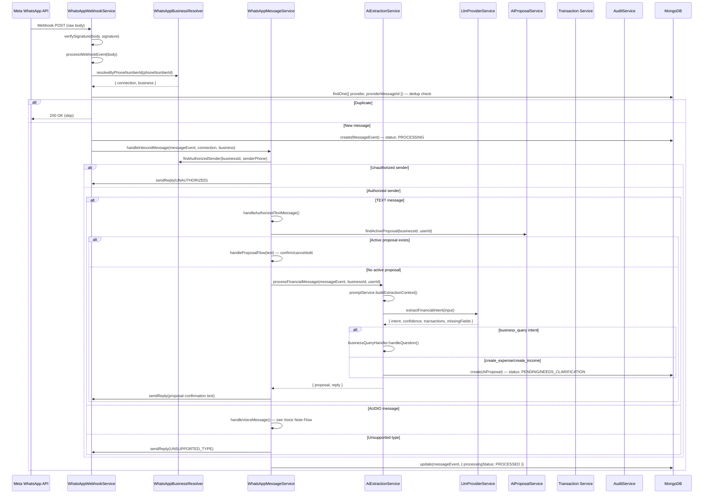
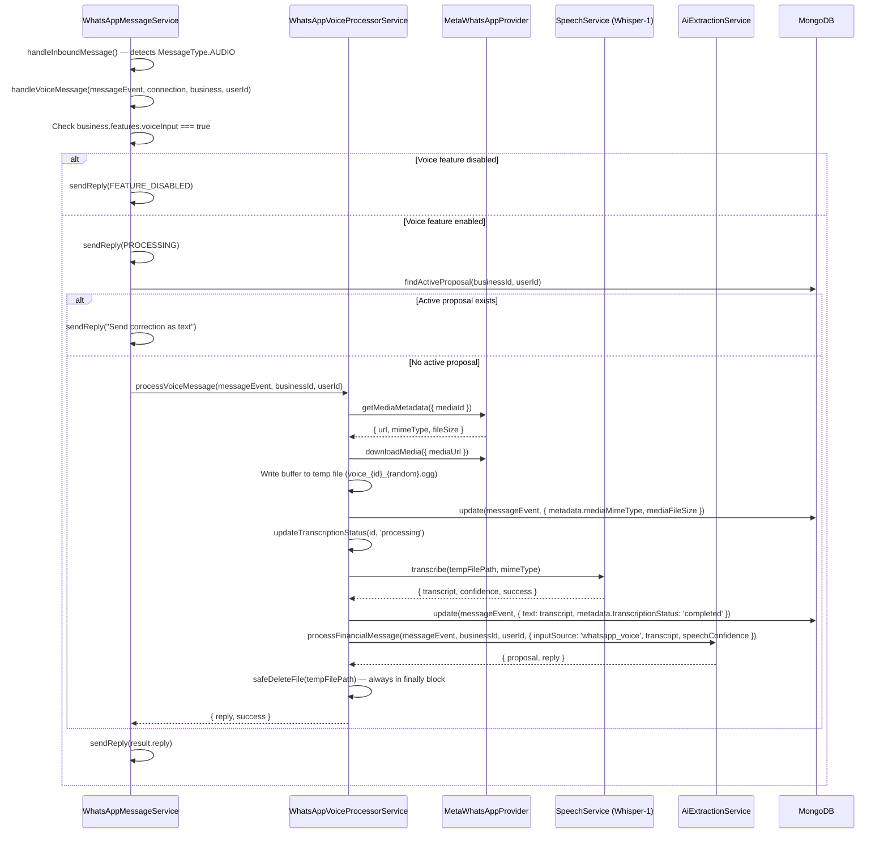
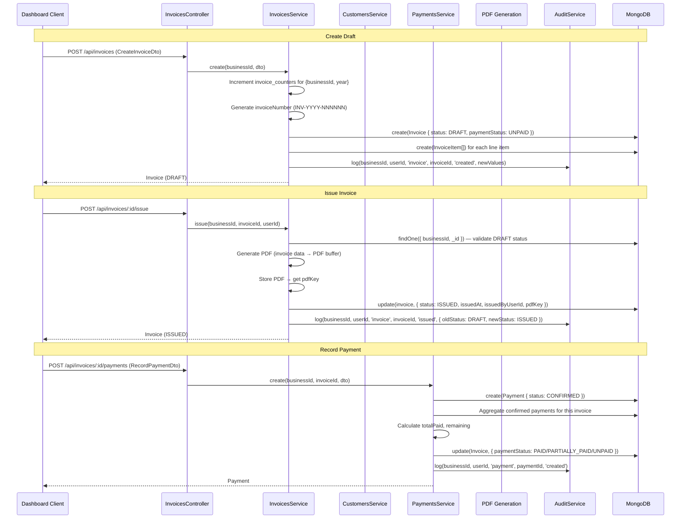
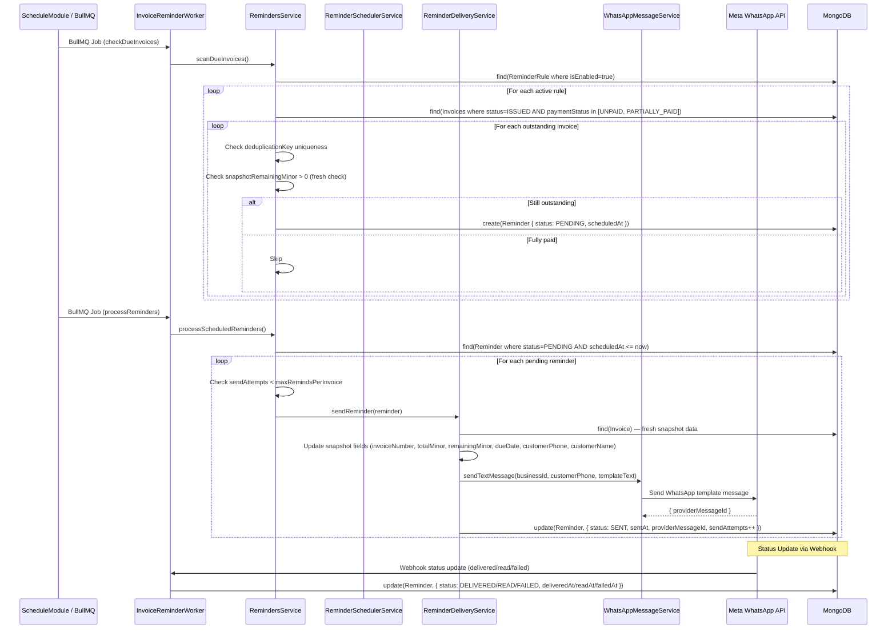
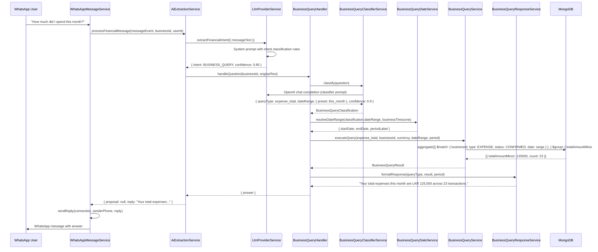

# Request Flows

End-to-end request flow documentation for all major operations in Dulan Progiciel. Each flow references exact source file locations.

---

## 1. WhatsApp Expense Flow

**Entry point**: `POST /api/whatsapp/webhook`



### Code References

| Step | File | Line(s) |
|------|------|---------|
| Webhook entry | `whatsapp.controller.ts` | POST `/whatsapp/webhook` |
| Signature verification | `whatsapp-webhook.service.ts:64-70` | `verifySignature()` |
| Event processing | `whatsapp-webhook.service.ts:72-96` | `processWebhookEvent()` |
| Business resolution | `whatsapp-business-resolver.service.ts` | `resolveByPhoneNumberId()` |
| Deduplication | `whatsapp-webhook.service.ts:115-123` | `findOne({ providerMessageId })` + unique index |
| Message event creation | `whatsapp-webhook.service.ts:127-144` | `messageEventModel.create()` |
| Inbound handling | `whatsapp-message.service.ts:40-86` | `handleInboundMessage()` |
| Sender authorization | `whatsapp-business-resolver.service.ts` | `findAuthorizedSender()` |
| Proposal flow | `whatsapp-message.service.ts:176-282` | `handleProposalFlow()` |
| AI extraction | `ai-extraction.service.ts:35-108` | `processFinancialMessage()` |
| LLM call | `llm-provider.service.ts:19-75` | `extractFinancialIntent()` |
| Proposal creation | `ai-extraction.service.ts:287-332` | `createProposal()` |
| Confirmation keywords | `ai.constants.ts` | `CONFIRMATION_KEYWORDS`, `REJECTION_KEYWORDS`, `EDIT_KEYWORDS` |

---

## 2. Voice Note Flow

**Entry point**: Same as text — `POST /api/whatsapp/webhook` with `message.type === 'audio'`



### Code References

| Step | File | Line(s) |
|------|------|---------|
| Voice routing | `whatsapp-message.service.ts:62-65` | `if (messageEvent.messageType === MessageType.AUDIO)` |
| Feature check | `whatsapp-message.service.ts:340` | `business.features?.voiceInput === true` |
| Processing message | `whatsapp-voice-processor.service.ts:43-110` | `processVoiceMessage()` |
| Audio download | `whatsapp-voice-processor.service.ts:112-147` | `downloadAudio()` |
| Media metadata | `whatsapp-provider.service.ts` | `getMediaMetadata()` |
| Media download | `whatsapp-provider.service.ts` | `downloadMedia()` |
| Temp file write | `whatsapp-voice-processor.service.ts:135` | `fs.writeFileSync(filePath, buffer)` |
| Transcription | `whatsapp-voice-processor.service.ts:58` | `speechService.transcribe(tempFilePath, mimeType)` |
| AI with voice context | `whatsapp-voice-processor.service.ts:75-84` | `extractionService.processFinancialMessage()` with `inputSource: 'whatsapp_voice'` |
| Temp cleanup | `whatsapp-voice-processor.service.ts:106-108` | `safeDeleteFile()` in `finally` block |
| Stale cleanup | `whatsapp-voice-processor.service.ts:197-224` | `cleanupStaleFiles()` — removes files > 1 hour old |

---

## 3. Invoice Flow

**Entry points**: `POST /api/invoices` (create), `POST /api/invoices/:id/issue`, `POST /api/invoices/:id/payments`



### Code References

| Step | File | Line(s) |
|------|------|---------|
| Create invoice | `invoices.controller.ts` | `POST /invoices` |
| Invoice number generation | `invoices.service.ts` | `invoice_counters` increment via `findOneAndUpdate` with upsert |
| Invoice schema | `invoice.schema.ts` | `invoiceNumber` unique on `{businessId, invoiceNumber}` (line 102) |
| Issue invoice | `invoices.controller.ts` | `POST /invoices/:id/issue` |
| PDF generation | `invoices.service.ts` | `generatePdf()` or similar |
| Record payment | `payments.controller.ts` | `POST /invoices/:id/payments` |
| Payment schema | `payment.schema.ts` | `amountMinor`, `method`, `status` |
| Outstanding recalculation | `invoices.service.ts` | Aggregate `payments` where `invoiceId` matches, compare sum to `totalMinor` |
| Audit logging | `audit.service.ts` | `log()` creates `audit_logs` entry |

---

## 4. Reminder Flow

**Entry point**: BullMQ job queue (triggered by `InvoiceReminderWorker`)



### Code References

| Step | File | Line(s) |
|------|------|---------|
| Worker entry | `invoice-reminder.worker.ts:43-62` | `reminderProcessor()` |
| Due invoice scan | `invoice-reminder.worker.ts:64-82` | `checkDueInvoicesProcessor()` |
| Reminder rules | `reminder-rule.schema.ts` | `{businessId, trigger}` unique index (line 51) |
| Reminder creation | `reminders.service.ts` | `scanDueInvoices()` |
| Deduplication | `reminder.schema.ts:88` | `{deduplicationKey: 1}` unique index |
| Fresh outstanding check | `reminders.service.ts` | Re-query invoice + payments to verify still outstanding |
| Delivery | `reminder-delivery.service.ts` | `sendReminder()` — template message via WhatsApp |
| Status tracking | `reminder.schema.ts` | `status` enum: PENDING → SENT → DELIVERED → READ (or FAILED) |
| Status webhook | `whatsapp-webhook.service.ts:205-226` | `processStatusUpdate()` updates `reminderModel` |

---

## 5. Business Question Flow

**Entry point**: WhatsApp text message classified as `business_query` by LLM



### Code References

| Step | File | Line(s) |
|------|------|---------|
| Intent detection | `ai-extraction.service.ts:81-89` | `if (extractionResult.intent === AiIntent.BUSINESS_QUERY)` |
| Question handler | `business-query.handler.ts` | `handleQuestion()` |
| LLM classifier | `business-query-classifier.service.ts:19-73` | `classify()` — calls OpenAI with structured classifier prompt |
| Fallback classifier | `business-query-classifier.service.ts:172-210` | `fallbackClassification()` — keyword-based when API unavailable |
| Date resolution | `business-query-date.service.ts` | `resolveDateRange()` — preset → concrete startDate/endDate |
| Query execution | `business-query.service.ts:35-77` | `executeQuery()` — switch on `BusinessQueryType` |
| MongoDB aggregations | `business-query.service.ts:79-681` | Individual methods: `getExpenseTotal`, `getIncomeTotal`, `getNetCashFlow`, etc. |
| Response formatting | `business-query-response.service.ts` | `formatResponse()` — natural language response |
| Query types enum | `business-query.enums.ts` | 12 query types: expense_total, income_total, net_cash_flow, transaction_count, expense_category_breakdown, income_category_breakdown, outstanding_amount, outstanding_invoices, overdue_invoices, unpaid_customers, invoice_status, recent_transactions |

---

## 6. Manual Transaction Flow

**Entry point**: `POST /api/transactions` (Dashboard form submission)

```mermaid
sequenceDiagram
    participant Client as Dashboard Client
    participant TC as TransactionsController
    participant TS as TransactionsService
    participant VAL as ValidationPipe
    participant AUD as AuditService
    participant DB as MongoDB

    Client->>TC: POST /api/transactions (CreateTransactionDto)
    TC->>VAL: ValidationPipe.validate(CreateTransactionDto)
    Note over VAL: whitelist, transform, forbidNonWhitelisted
    VAL-->>TC: Validated DTO

    TC->>TS: create(businessId, userId, dto)
    TS->>DB: create(Transaction {
        businessId,
        type: INCOME/EXPENSE,
        amountMinor,
        currency,
        categoryId,
        customerId?,
        date,
        description?,
        notes?,
        paymentMethod?,
        source: MANUAL,
        status: CONFIRMED,
        createdByUserId: userId,
        confirmedByUserId: userId,
        confirmedAt: now
    })

    TS->>AUD: log({
        businessId,
        userId,
        entityType: 'transaction',
        entityId: transaction._id,
        action: 'created',
        newValues: { type, amountMinor, currency, categoryId, date, ... }
    })

    TS-->>Client: Transaction (CONFIRMED)

    Note over Client,DB: Dashboard/Reports Update
    Client->>Client: Refetch transactions list
    Client->>Client: Update dashboard summary (income/expense totals)
    Client->>Client: Update reports (category breakdown, cash flow)
```

### Code References

| Step | File | Line(s) |
|------|------|---------|
| Controller | `transactions.controller.ts` | `POST /transactions` |
| DTO validation | `transactions/dto/create-transaction.dto.ts` | class-validator decorators |
| Global ValidationPipe | `main.ts:67-74` | `whitelist`, `transform`, `forbidNonWhitelisted` |
| Transaction schema | `transaction.schema.ts` | `amountMinor` (min: 1), `type` enum, `source` enum, `status` enum |
| Source enum | `transaction-source.enum.ts` | `MANUAL`, `WHATSAPP` |
| Status enum | `transaction-status.enum.ts` | `CONFIRMED`, `VOIDED` |
| Audit logging | `audit.service.ts` | Creates `audit_logs` entry with `oldValues`/`newValues` |
| Soft void | `transaction.schema.ts:64-70` | `voidedAt`, `voidedByUserId`, `voidReason` — never hard delete |
