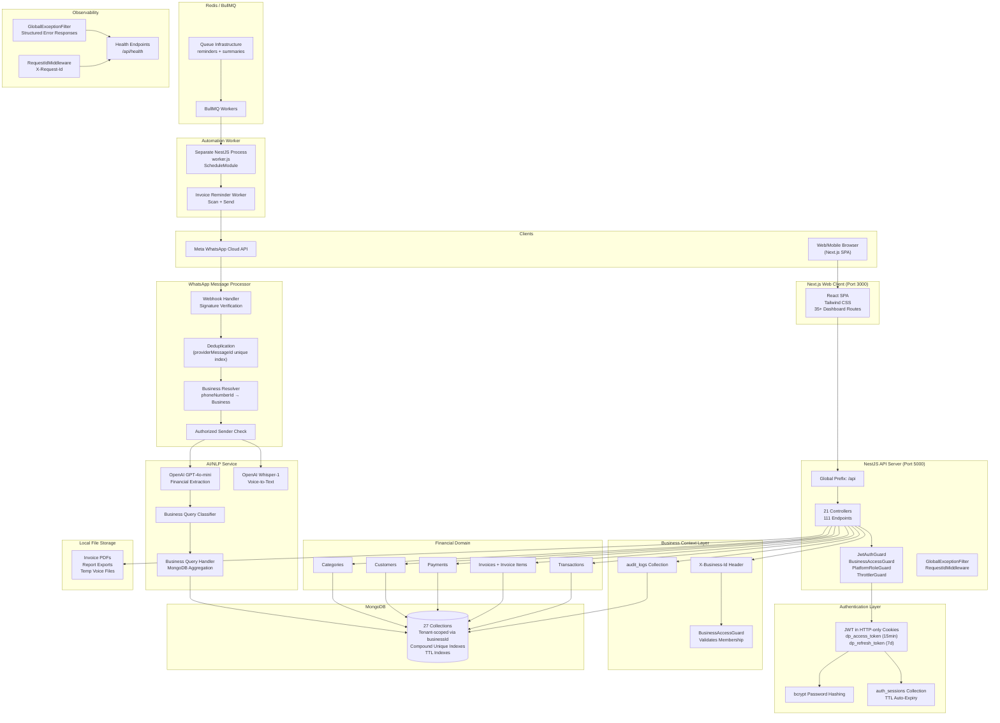

# System Architecture

Dulan Progiciel is a WhatsApp-first business finance assistant for Sri Lankan SMEs. It captures income/expenses via WhatsApp messages, generates invoices, sends payment reminders, and answers business questions — all powered by AI extraction and a multi-tenant NestJS backend.

## Architecture Diagram

## Layer Descriptions

### Next.js Web Client

- **Technology**: Next.js (React SPA), Tailwind CSS, TypeScript
- **Port**: 3000
- **Routes**: 35+ dashboard routes organized under `/dashboard/` with nested routes for transactions, invoices, customers, reports, settings, AI proposals, summaries, and ops
- **Auth**: Uses `AuthContext` for client-side auth state; cookies set HTTP-only by the API
- **Key directories**: `frontend/src/app/dashboard/`, `frontend/src/services/`, `frontend/src/types/`, `frontend/src/components/`

### NestJS API Server

- **Technology**: NestJS with Mongoose, class-validator, helmet, cookie-parser
- **Port**: 5000 (configurable via `PORT` env)
- **Global prefix**: `/api` (set in `main.ts:63`)
- **21 controllers**: `auth`, `users`, `businesses`, `categories`, `transactions`, `customers`, `invoices`, `payments`, `whatsapp`, `ai`, `reports`, `reminders`, `summaries`, `usage`, `entitlements`, `beta`, `feedback`, `data-requests`, `product-analytics`, `health`, `ops`
- **111 endpoints** across these controllers
- **Global pipes**: `ValidationPipe` with `whitelist`, `transform`, `forbidNonWhitelisted`, `enableImplicitConversion` (`main.ts:67-74`)
- **Rate limiting**: `ThrottlerModule` with configurable TTL (default 60s) and limit (default 60 req/min) (`app.module.ts:41-52`)
- **Graceful shutdown**: SIGTERM/SIGINT handlers with 10s timeout (`main.ts:86-100`)

### Authentication Layer

- **JWT tokens** stored in HTTP-only cookies: `dp_access_token` (15min TTL) and `dp_refresh_token` (7-day TTL) (`auth.controller.ts:39-48`)
- **bcrypt** password hashing (via `AuthService.register`)
- **Session management**: `auth_sessions` collection stores `tokenHash`, `expiresAt`, `revokedAt` per session; MongoDB TTL index on `expiresAt` auto-expires stale sessions (`auth-session.schema.ts:32`)
- **Refresh flow**: `POST /api/auth/refresh` reads `dp_refresh_token` cookie, validates against `auth_sessions`, issues new token pair, rotates refresh token
- **Logout**: `POST /api/auth/logout` revokes current session; `POST /api/auth/logout-all` revokes all sessions for the user

### Business Context Layer

- **Mechanism**: Every authenticated request to business-scoped endpoints must include `X-Business-Id` header
- **BusinessAccessGuard** (`business-access.guard.ts:17-60`): Validates that the authenticated user has an active `BusinessMember` record for the given `businessId`; injects `request.businessContext` with `businessId` and `role`
- **PlatformRoleGuard** (`platform-role.guard.ts:12-40`): Optional role-based access for ops/admin endpoints using `@PlatformRoles()` decorator
- **Audit logging**: All mutations create entries in `audit_logs` with `entityType`, `entityId`, `action`, `oldValues`, `newValues`

### Financial Domain

All financial entities are tenant-scoped via `businessId` (MongoDB ObjectId ref to `Business`):

| Entity | Collection | Key Fields |
|--------|-----------|------------|
| Transaction | `transactions` | `type` (income/expense), `amountMinor`, `currency`, `categoryId`, `date`, `source` (manual/whatsapp), `status` (confirmed/voided) |
| Invoice | `invoices` | `invoiceNumber` (unique per business per year), `customerId`, `customerSnapshot`, `subtotalMinor`, `totalMinor`, `status` (draft/issued/voided), `paymentStatus` |
| InvoiceItem | `invoice_items` | `invoiceId`, `description`, `quantity`, `rateMinor`, `amountMinor`, `sortOrder` |
| InvoiceCounter | `invoice_counters` | `businessId`, `year`, `sequence` (unique per business+year) |
| Payment | `payments` | `invoiceId`, `customerId`, `amountMinor`, `method`, `status` |
| Customer | `customers` | `name`, `phone`, `email`, `address`, `status` |
| Category | `categories` | `name`, `type` (income/expense), `isSystem`, unique per business+name+type |

### WhatsApp Message Processor

- **Webhook endpoint**: `POST /api/whatsapp/webhook` — raw body preserved for signature verification (`main.ts:37-61`)
- **Signature verification**: `MetaWhatsAppProviderService.verifyWebhookSignature()` using HMAC with `WHATSAPP_APP_SECRET`
- **Deduplication**: Two-level — in-memory check on `providerMessageId` + unique compound index on `{provider, providerMessageId}` (`message-event.schema.ts:108`)
- **Business resolution**: `WhatsAppBusinessResolverService.resolveByPhoneNumberId()` maps `phoneNumberId` → `WhatsAppConnection` → `Business`
- **Sender authorization**: `findAuthorizedSender()` checks `whatsapp_authorized_senders` for verified senders per business
- **Message flow**: Webhook → Dedup → Business Resolution → Sender Auth → Text/Voice routing → AI Extraction → Proposal → Reply

### AI/NLP Service

- **Provider**: OpenAI API (GPT-4o-mini by default, configurable via `AI_MODEL` env)
- **Financial extraction** (`llm-provider.service.ts`): Structured JSON output with intent classification (`create_expense`, `create_income`, `business_query`, `unknown`), confidence scoring, missing field detection, clarification questions
- **Business query classifier** (`business-query-classifier.service.ts`): Classifies questions into 12 query types (expense_total, income_total, net_cash_flow, transaction_count, expense_category_breakdown, income_category_breakdown, outstanding_amount, outstanding_invoices, overdue_invoices, unpaid_customers, invoice_status, recent_transactions)
- **Business query handler** (`business-query.service.ts`): Executes MongoDB aggregation pipelines based on classified query type, with date range resolution and natural language response generation
- **Fallback**: Rule-based extraction when `AI_API_KEY` is not configured
- **Timeout**: Configurable via `AI_REQUEST_TIMEOUT_MS` (default 15s); AbortController pattern

### Speech Service

- **Provider**: OpenAI Whisper-1 API
- **Flow**: Audio download from Meta → temp file storage → transcription → pipeline integration
- **Temp management**: Files stored in configurable `VOICE_TEMP_STORAGE_PATH` (default `./storage/temp/voice`); auto-deleted after processing unless `VOICE_DELETE_AFTER_PROCESSING=false`
- **Stale cleanup**: `cleanupStaleFiles()` removes files older than 1 hour

### Redis / BullMQ

- **Configuration**: `REDIS_HOST` (default 127.0.0.1), `REDIS_PORT` (default 6379), optional `REDIS_PASSWORD` and `REDIS_TLS` (`redis.config.ts`)
- **Queue module**: `QueueModule` manages BullMQ queues for reminders and summaries
- **Purpose**: Decouples scheduled tasks from the main API process; workers can run independently

### Automation Worker

- **Entry point**: `worker.ts` — separate NestJS application context (`NestFactory.createApplicationContext`)
- **Module**: `WorkerModule` imports `ScheduleModule.forRoot()` for cron-based scheduling
- **Loaded modules**: Users, Businesses, Categories, Transactions, Customers, Invoices, Payments, WhatsApp, AI, Speech, Files, Audit, Health, Queue, Reminders, Summaries
- **Invoice reminder worker** (`invoice-reminder.worker.ts`): BullMQ job processors for `reminderProcessor` (processes scheduled reminders) and `checkDueInvoicesProcessor` (scans for due invoices)
- **Graceful shutdown**: SIGTERM/SIGINT handlers

### MongoDB

- **Database**: MongoDB (configured via `MONGODB_URI`)
- **27 collections** across 8 domain groups
- **Tenant isolation**: All business-scoped collections have `businessId` field with compound indexes
- **Connection**: `MongooseModule.forRootAsync` with 5s `serverSelectionTimeoutMS`
- **Key indexes**: Compound unique indexes on business-scoped unique constraints (e.g., `{businessId, invoiceNumber}`, `{businessId, name, type}` for categories, `{businessId, trigger}` for reminder rules)
- **TTL indexes**: `auth_sessions.expiresAt`, `ai_proposals.expiresAt`, `whatsapp_pairing_codes.expiresAt`

### Local File Storage

- **Invoice PDFs**: Generated on invoice issue, stored with `pdfKey` reference in `invoices.pdfKey`
- **Report exports**: CSV/PDF exports for data-requests module
- **Temporary voice files**: Audio downloads for transcription, auto-cleaned after processing
- **Module**: `FilesModule` manages file I/O operations

### Observability

- **GlobalExceptionFilter** (`global-exception.filter.ts`): Catches all exceptions, returns structured `{success, message, error: {code}, requestId}` responses; logs 5xx as errors, 4xx as warnings
- **RequestIdMiddleware** (`request-id.middleware.ts`): Assigns `X-Request-Id` to every request (accepts incoming header up to 128 chars, otherwise generates UUIDv4)
- **Health endpoints**: `GET /api/health` in `HealthModule`
- **Structured logging**: NestJS Logger with `error`, `warn`, `log` levels; module-specific log contexts
